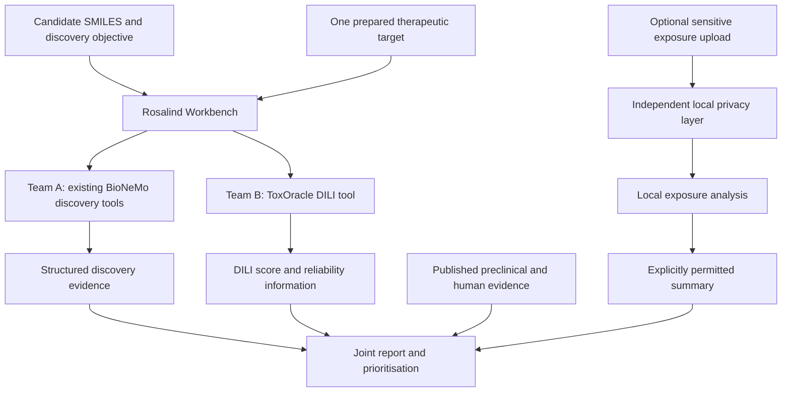

# ToxOracle: shared hackathon build plan

Date: 19 September 2026  
Audience: Team A (Rosalind discovery workflow) and Team B (human DILI model)  
Status: implementation guideline; proposed defaults below can be adjusted jointly at kickoff.

## 1. Product and definition of success

Build one researcher-facing workflow in which Rosalind uses existing BioNeMo tools to assess drug candidates, calls a separate ToxOracle model to predict human liver-toxicity concern, and combines the evidence into candidate priorities and recommended experiments.

**Primary demonstration:** Adding human DILI prediction changes which discovery candidates we prioritise and what experiments we recommend.

**Additional demonstration, when evidence supports it:** The model flags a documented human liver liability that a specified preclinical assay did not detect. Published assay results can supply this comparator; a separately trained preclinical model is not required.

The MVP predicts drug-level DILI concern, not individual patient outcomes, overall clinical success, or therapeutic efficacy. A recommendation for a 3D liver experiment is initially a transparent triage rule, not a trained prediction of experimental benefit.

### Required MVP

- A candidate list enters the workflow as compound IDs and SMILES.
- One defined discovery task runs using existing tools/models.
- A separate toxicity tool returns a DILI score, model provenance, and applicability/uncertainty information.
- The same candidate IDs appear in both outputs and the combined report.
- Users can compare discovery-only priorities with priorities after toxicity assessment.
- Recommendations explain which evidence supports the next experiment.
- Three cached cases and a complete saved walkthrough remain usable if live services fail.

### Stretch work, only after integration works

- Candidate generation, additional targets, or additional toxicity endpoints.
- Optional human exposure input through an independent local privacy boundary.
- Exposure-aware retraining, mechanistic proxy models, molecular foundation embeddings.
- Quantitative preclinical-human discrepancy, if comparable evidence supports its definition.
- Formal hallucination assessment or token-efficiency benchmarking.

## 2. Architecture and resource assumptions

The team has full hackathon access to Codex (Astra), GPT-Rosalind/Workbench, BioNeMo Agent Toolkit/models, and Brev GPUs. Ask for required credentials rather than assuming access is unavailable. Keep credentials outside the repository and artifacts.

Official documentation supports Rosalind as a scientific tool orchestrator and BioNeMo Agent Toolkit as tools/skills/interfaces to scientific models. NVIDIA reports OpenAI integration, but the exact tools enabled in this Workbench session must be checked. Do not assume a mandatory nested BioNeMo agent or an undocumented Workbench API.



The toxicity model is computationally separate but callable within the same researcher workflow. It does not need to be a BioNeMo model. Only Team B trains a model in the core plan; Team A uses existing models.

## 3. Ownership and handoffs

| Work item | Accountable team | Handoff |
|---|---|---|
| Workbench access, callable tool inventory and orchestration | A | Verified invocation path and one real tool result |
| Discovery objective, target preparation and reference ligand | A, with biologist | Target manifest and candidate fixture |
| BioNeMo execution and discovery evidence | A | Discovery result contract |
| DILI data, structures, splitting, training and evaluation | B | Versioned model and evaluation report |
| Pretrained fallback assessment | B | Reproducible inference and documented training membership limitations |
| Toxicity tool interface | B | Prediction contract and working adapter/service |
| Historical preclinical-miss evidence | B, with biologist | Cited case records reviewed jointly |
| Combined report, before/after view and agent prompts | A | End-to-end researcher workflow |
| Triage rule and scientific claims | Joint | One agreed rule and claims checklist |
| Optional local privacy/exposure tool | B owns boundary; A consumes permitted result | No raw sensitive upload through Workbench |

At kickoff, each team names one integration contact. Team A owns the canonical candidate ID list. Team B returns those IDs unchanged. Neither team changes shared field names or meanings without notifying the other.

## 4. Team A: conventional discovery workflow

### A1. Verify the actual execution path

1. Inspect the Workbench's available scientific tools and supported custom-tool connection mechanism.
2. Run one real BioNeMo request and save the tool/model version, input, output, and artifact paths.
3. Verify how the toxicity callable can be reached. Use a supported tool connector or adapter. Do not design around assumed Workbench endpoints.
4. If a direct connection cannot be completed in time, use a reproducible file handoff: export candidates, run Team B's batch command, and import its result into Workbench. Label this as a manual integration step in the demo.

### A2. Freeze one discovery task

Default: assess a small candidate set against one therapeutic protein. The biologist supplies:

- Target name, species, UniProt ID if available, and intended biological action.
- A suitable PDB entry/file, relevant chain/domain, and essential cofactors or structural constraints.
- A known reference ligand, preferably in an experimental complex.
- Candidate SMILES; known controls if available.

Prepare the target once. Store the preparation choices and reference identifiers in a target manifest. The target need not be a liver protein: liver toxicity is the safety assessment across candidates.

DiffDock is a concrete option for ligand poses from protein PDB plus ligand SMILES/SDF. Its pose confidence is not affinity or efficacy. If using another scorer for candidate ranking, retain its name, units, direction, and interpretation. Do not rank therapeutic promise solely by comparing pose confidence across compounds.

If only docking is available, present pose plausibility and calculated molecular properties, with a clearly labelled provisional discovery rubric agreed with the biologist. If no defensible ranking is available, keep candidates unranked and demonstrate how toxicity changes the follow-up shortlist.

### A3. Deliver structured evidence

- Canonical candidate IDs and submitted structures.
- Target and tool/model versions.
- Named scores, units where applicable, and whether higher or lower is preferred.
- Pose/artifact references and execution status.
- Discovery priority and the explicit rule producing it, if ranking is supported.

Optional GenMol generation comes after the screening flow works. Its generated SMILES must go through the same validation and toxicity pipeline as uploaded molecules.

## 5. Team B: human DILI model

### B1. Assemble the minimum dataset

Start with FDA **DILIrank 2.0**, then attach verified chemical structures. Proposed binary target:

- Positive: Most-DILI-concern and Less-DILI-concern.
- Negative: No-DILI-concern.
- Exclude Ambiguous-DILI-concern initially; preserve original categories.

The FDA lists 1,336 entries, of which 982 are non-ambiguous before structure matching and filtering. Do not report 982 as the final training count. Restrict the first model to suitable small molecules; record excluded biologics, mixtures, unmatched structures and other exclusions.

Minimum curated fields:

```text
compound_id,compound_name,canonical_smiles,structure_key,
original_dili_category,dili_label,label_source,structure_source
```

Use a documented standardisation policy for salts, parent compounds and duplicates. Keep the mapping to source entries. Resolve conflicting labels explicitly. Label sections and severity annotations are provenance/targets, not predictive input features.

### B2. Freeze evaluation before training

- Assign compound groups to training, validation and test partitions before model fitting.
- Prefer a scaffold-disjoint split if class coverage permits; otherwise use a compound-disjoint split and report the limitation.
- Reserve intended unseen demonstration cases before feature selection, tuning or training.
- Fit preprocessing, feature selection, calibration and decision thresholds without test labels.
- Keep all forms/replicates of the same compound together according to the documented grouping policy.
- If using auxiliary pretrained predictors, inspect their training overlap with the evaluation set too.

### B3. Train the simplest credible model

Default first implementation: Morgan fingerprints (radius 2, 2,048 bits) into a random forest classifier. Use a small, fixed tuning budget. A logistic regression baseline is useful if time permits; do not delay integration for an architecture search.

The user supplies SMILES only. Features are computed internally. BioNeMo embeddings and Seal-style predicted proxy features are extensions, not mandatory inputs.

Expose an uncalibrated output as a **model score**. Use **probability** only when calibration has been assessed appropriately. In either case, the target is drug-level DILI concern, not the incidence of liver injury in patients.

Minimum evaluation report:

- Final counts, class balance, exclusions and split procedure.
- AUROC, average precision, sensitivity, specificity, and confusion matrix at a validation-selected threshold.
- Calibration/Brier assessment if presenting probabilities.
- A clearly explained applicability indicator, such as nearest-training-compound fingerprint similarity. Similarity is not a confidence probability.
- Test-set limitations and model/training-data versions.

Do not invent a confidence interval. Use a documented uncertainty method if implemented; otherwise return `null` with a reason and retain the applicability information.

### B4. Fallback without changing the interface

If the curated dataset/model cannot be completed, integrate a published pretrained predictor. Seal's DILIPredictor is a candidate to inspect; Eltahir's MultiEndpointTox is another reference, with the supplied version being a preprint.

Before relying on a fallback, verify its actual code/artifacts, dependencies, input format, permitted use, reproducible inference, output meaning and available training identifiers. Do not copy paper performance numbers into the evaluation of this implementation.

Mark model origin `pretrained`. If case membership is unknown, mark it `unknown` and describe the example as retrospective illustration. The same prediction contract must work for trained and pretrained models.

## 6. Shared interface: agree before building independently

These are ToxOracle application contracts, not claimed vendor API schemas. Team B implements `predict_dili` as a batch callable, with JSON file input/output as the guaranteed fallback. An HTTP or Workbench adapter can wrap the same function.

### Prediction request

```json
{
  "schema_version": "1.0",
  "request_id": "demo_run_01",
  "compounds": [
    {"compound_id": "candidate_001", "smiles": "CCO"}
  ]
}
```

`CCO` is a schema example only, not a nominated discovery candidate. Require unique nonempty IDs, valid JSON and a bounded batch size agreed by both teams. Return a result for each input ID, including failures. Never silently drop an invalid or unsupported structure.

### Prediction response

The null fields below illustrate unavailable values, not computed predictions.

```json
{
  "schema_version": "1.0",
  "request_id": "demo_run_01",
  "model": {
    "id": "toxoracle_dili_v1",
    "origin": "trained",
    "training_data_version": "curated_dilirank2_v1",
    "target": "most_or_less_DILI_concern_vs_no_concern"
  },
  "results": [
    {
      "compound_id": "candidate_001",
      "status": "not_run",
      "canonical_smiles": "CCO",
      "score": null,
      "score_kind": "uncalibrated_model_score",
      "decision_threshold": null,
      "risk_band": "unavailable",
      "uncertainty": {"method": "not_implemented", "value": null},
      "applicability": {"method": "nearest_train_tanimoto", "value": null},
      "training_membership": "unknown",
      "evidence_refs": [],
      "warnings": ["Schema example; inference has not run"],
      "error": null
    }
  ]
}
```

Status values: `ok`, `invalid_input`, `unsupported`, `failed`, `not_run`. A failed prediction is never a low-risk result. Successful scores must be finite and within their documented range. A binary threshold is sufficient for v1; do not add multiple risk bands without defining their thresholds.

Team A's matching discovery record must include:

```text
compound_id, status, target_id, tools_and_versions,
scores[{name,value,unit,direction,meaning}],
artifact_refs[], discovery_priority, priority_method
```

The joint record adds `toxicity_result`, `preclinical_evidence_refs`, `recommendation`, `recommendation_rule_version`, and `rationale`. Keep discovery scores and toxicity scores separate; do not subtract docking confidence from DILI prediction.

## 7. Prioritisation and researcher output

Agree the discovery criterion with the biologist and the DILI threshold from validation. Use a versioned, explicit policy:

| Discovery evidence | DILI/reliability evidence | Initial recommendation |
|---|---|---|
| Promising by agreed criterion | Elevated concern, credible applicability | Consider targeted human-relevant liver validation before advancement |
| Promising | Uncertain or outside supported chemical space | Gather safety evidence; consider an assay that resolves the uncertainty |
| Promising | Lower predicted concern | Continue planned evaluation; do not label safe |
| Weak | Elevated concern | Deprioritise unless other evidence justifies further work |
| Any | Toxicity tool failed | Assessment incomplete; retry or review |

High toxicity alone does not establish that a costly 3D experiment is worthwhile. Include therapeutic promise, uncertainty and whether the result could change the decision.

Return a table with candidate, discovery evidence, DILI assessment, reliability, original priority, revised priority and next experiment. Add a candidate detail view with artifacts and sources. An agent narrative must be generated from these records, not used to invent quantitative results.

For experiments, name the question, relevant assay/model and proposed readouts. Mechanistic claims require evidence; fingerprint feature attribution alone does not establish a biological mechanism. If mechanism evidence is absent, recommend broader liver-safety characterisation and say why.

## 8. Historical preclinical-miss cases

Team B and a biologist curate a small evidence file. For each case record:

```text
compound_id, canonical_smiles,
preclinical_assay, species_or_cell_system, concentration_and_duration,
reported_result, positivity_definition, assay_source_and_locator,
human_DILI_evidence, human_source_and_locator,
model_training_membership, held_out_prediction, interpretation_limitations
```

Require an actual negative/not-flagged result, not an absence of published testing. Name the assay and conditions. A historical failure, late withdrawal or DILI-positive label alone does not establish that preclinical screening missed it.

Claim levels:

1. **Integrated product:** the model changes follow-up priorities. Supported by the working pipeline and transparent before/after comparison.
2. **Retrospective illustration:** a model flags a documented miss, but training membership is included/unknown. State that limitation.
3. **Held-out case:** a model flags a documented miss excluded from training and tuning. Supports a case-level result.
4. **General performance claim:** requires a suitable evaluated cohort, including negatives, with held-out metrics and limitations.

Do not keep searching for attractive cases after inspecting the test results and present them as a prespecified evaluation. Report case selection honestly. No numerical translational gap is required for the MVP; use a sourced side-by-side comparison.

## 9. Optional exposure and privacy branch

Only start after the core integration milestone. Keep sensitive raw data outside Workbench, external prompts, remote tool payloads, telemetry and logs. Brev is remote compute; it is not automatically inside a local-data boundary.

Minimum optional input: compound ID, scenario ID, Cmax value/unit, total or unbound basis, provenance, and regimen context where available. Use synthetic/public examples to demonstrate the boundary first.

The independent local component validates a structured schema, rejects unsupported fields and releases only an explicitly permitted result. Removing names alone is not sufficient evidence that subject-level data are safe to transmit.

Without matched exposure training data, keep the DILI prediction unchanged. If a suitable toxicity concentration is available, return an endpoint-specific exposure margin with units, concentration basis, assay conditions and assumptions. Missing toxicity concentration means no margin can be calculated. Do not generate one from Cmax alone.

An exposure-aware DILI probability requires training and evaluation using compatible exposure features. Treat this as a separate model version.

## 10. Relative build schedule and integration gates

Use these as timeboxes from kickoff; compress proportionally if less than a day remains.

| Time | Team A | Team B | Joint gate |
|---|---|---|---|
| 0–1 h | Verify tools; choose task/target | Confirm data/pretrained path | Freeze candidate IDs and v1 contracts |
| 1–3 h | Run one real discovery call | Curate initial data; provide labelled mock response | A successfully consumes B's response |
| 3–6 h | Build structured discovery output | Train first baseline or run fallback; begin case curation | Replace mock with real toxicity inference |
| 6–10 h | Connect tool and combined report | Freeze model/threshold; evaluate | One complete real end-to-end run |
| 10–16 h | Before/after priorities and artifact display | Reliability report and case evidence | Verify claims and recommendation logic |
| Final 2–3 h | Cache, rehearse and record | Freeze model/results | Three cases, backup workflow, pitch audit |

If integration slips, cut generation, extra targets, exposure and UI polish first. Preserve real discovery execution, real toxicity inference and traceable recommendations. Do not spend the final hours searching for a better dataset.

## 11. Suggested repository organisation

The directory scaffold is now created; see `docs/repository.md` for the full tree and `CONTRIBUTING.md` for workflow conventions. These locations reserve responsibilities; runnable components and execution commands remain implementation deliverables.

```text
contracts/             shared schemas and valid/invalid fixtures
discovery/             Team A tool adapters and workflow instructions
toxicity/              Team B feature pipeline, training and inference
data/manifests/        source, mapping, exclusion and split manifests
evaluation/            metrics, calibration and applicability reports
cases/                 cited historical case records
demo/                  permitted cached requests/results and walkthrough
docs/                  setup, target preparation and model notes
```

Keep restricted datasets, credentials and large model artifacts out of Git. Each team supplies a reproducible setup and execution command in its README. Pin dependencies/model versions and record artifact locations/checksums as appropriate. Share mocks early, clearly marked `not_run`; never leave mock scores in the final demonstration.

## 12. Final acceptance checklist

- [ ] Candidate IDs survive both branches and the join without mismatches.
- [ ] At least one real BioNeMo discovery task and one real DILI prediction run.
- [ ] Invalid SMILES, unsupported compounds and a tool failure are handled visibly.
- [ ] Every score has a defined meaning and model/source provenance.
- [ ] Model evaluation uses appropriate held-out compounds; pretrained overlap is disclosed.
- [ ] Before/after priorities use the same candidates and an explicit policy.
- [ ] At least one recommendation states what experiment would resolve which uncertainty.
- [ ] Preclinical-miss claims have both assay and human evidence and a membership label.
- [ ] Sensitive inputs, if supported, never enter external systems before the local boundary.
- [ ] Three permitted cached cases and a backup recording/report are ready.
- [ ] Both teams can follow the setup instructions and reproduce their part.

## 13. Reference starting points

- [FDA DILIrank 2.0](https://www.fda.gov/science-research/liver-toxicity-knowledge-base-ltkb/drug-induced-liver-injury-rank-dilirank-20-dataset): human label definitions and source table.
- [Rosalind Workbench](https://developers.openai.com/blog/rosalind-workbench): scientific orchestration and tool connection context.
- [BioNeMo Agent Toolkit workflow](https://developer.nvidia.com/blog/build-an-ai-scientist-for-life-science-discovery-with-nvidia-bionemo-agent-toolkit/): agent-callable skills/models and deployment choices.
- [NVIDIA integration announcement](https://nvidianews.nvidia.com/news/nvidia-launches-bionemo-agent-toolkit-giving-ai-agents-the-tools-to-accelerate-scientific-discovery): OpenAI integration context, not proof of session configuration.
- [DiffDock model card](https://docs.api.nvidia.com/nim/reference/mit-diffdock): input/output semantics.
- [GenMol endpoint documentation](https://docs.nvidia.com/nim/bionemo/genmol/2.0.0/endpoints.html): optional generation branch.
- `refs/papers/Seal(2024).pdf`: structure-only inference using predicted proxy/PK features; inspect accompanying implementation before reuse.
- `refs/papers/Eltahir(2026).pdf`: multi-endpoint structure-based approach; supplied version is a preprint.
- `refs/papers/Ewart(2022).pdf` and `refs/papers/Bergen(2025).pdf`: potential experimental-context and case-evidence sources; verify the exact assay/compound claims.

The present plan supersedes the earlier sketches for the agreed first-build scope: **existing discovery tools plus one additional human DILI model**, with published preclinical evidence used for case studies when available.
