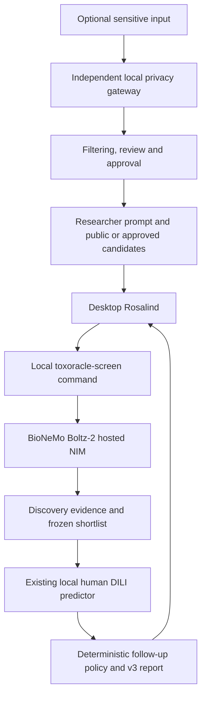

# ToxOracle: discovery-first hackathon build plan

Updated: 19 September 2026. This plan supersedes the earlier requirement for Team A
to supply a second toxicity predictor. The agreed implementation is on
`feat/rosalind-boltz2-screening`; the trained Team B model stays unchanged.

Advanced development is isolated on `feat/target-only-generation` in
[the target-only generation plan](docs/decisions/target-only-generation-plan.md).
The new command is documented in the [advanced runbook](docs/runbooks/target-only-generation.md).
This document remains the frozen MVP/demo scope; advanced acceptance is recorded separately.

## 1. Objective and demonstration

A researcher prompts Rosalind to assess a fixed candidate panel against one target.
BioNeMo supplies discovery evidence; the local ToxOracle model adds human DILI
concern. Show the discovery-only shortlist and how that additional information
changes follow-up decisions and recommended experiments.

DILIrank 2.0 describes human liver-toxicity concern, not preclinical assay results.
The model applies knowledge from human-labelled drugs during early discovery.
A lower prediction does not establish safe human exposure. The current model does
not predict patient-level outcomes, doses, exposure margins or therapeutic efficacy.

The initial demonstration is retrospective. Candidate training/validation membership
must be visible; report held-out aggregate performance separately. A successful
software run is not prospective validation or proof of a preclinical miss. An actual
preclinical-miss claim still needs sourced assay-negative and human-outcome evidence.

## 2. Architecture and resource boundary

Rosalind's reported local shell capability is the first connection mechanism.
It must have explicit workspace-write and external-network permissions where its
session requires them. No custom MCP server is needed for the initial implementation.
The installed Rosalind plugin is a Workbench launcher, not a headless scientific API.
A terminal run does not itself prove desktop Rosalind integration.

The team has access to Rosalind, NVIDIA/BioNeMo and Brev. Ask for required credentials;
do not infer lack of entitlement from missing environment variables. The default
execution route is NVIDIA's hosted Boltz-2 API. Credentials never enter Git, reports
or logs. Public compounds may be submitted directly; sensitive input must pass the
separate local gateway. Privacy OFF is local preview only; export requires filtering,
review and approval. Scientific false-positive retention needs per-field local
acknowledgement and audit counts. Exposure-aware training remains deferred.

## 3. Frozen discovery experiment

- Human ABL1 kinase domain: PDB 2HYY chain A, deposited polymer entity 1 sequence,
  UniProt P00519. Preserve sequence/source checksums and preparation description.
- Fixed public panel: imatinib (LT00107, reference), dasatinib (LT01248), nilotinib
  (LT00607), bosutinib (LT02349). Use the curated parent structures and shared atom IDs.
- BioNeMo model: hosted Boltz-2 NIM. One protein and one affinity ligand per request.
  Sequence-based cofolding; no custom MSA, pocket constraint or structural template.
- Settings: 3 recycling steps; 50 structure-sampling steps; 1 structure sample;
  200 affinity-sampling steps; 5 affinity samples; mmCIF output; molecular-weight
  correction off. Preserve every returned score array and raw response.
- Discovery rule: descending arithmetic mean of returned binder-likelihood values;
  exact ties broken by compound ID. Top two successful scored candidates are
  shortlisted. This is a provisional relative screen, not a validated efficacy rule.
- Structural confidence is separate from binder likelihood and predicted affinity.
  Missing binding output leaves a candidate unranked; never substitute confidence.
- The panel and rule are frozen before panel DILI inference. Do not tune them to
  manufacture a preferred demo outcome. Do not automatically replace a held candidate.

The manifest is `demo/examples/abl1_experiment.json`. The reference gate requires a
usable predicted complex, binder likelihood and an affinity value before the rest
of the panel is executed. Actual predicted-pose atom mapping/contacts are unavailable
in this adapter; retain the shared input molecular graph and raw complex artifacts.

## 4. Existing Team B model

Reuse the evaluated random-forest baseline and v2 inference CLI. Features are
structure-derived Morgan fingerprints. No retraining is part of this workflow.

The current curated model set has 802 structures: 539 training, 158 validation and
105 test. Related scaffold/connectivity groups stay together. Calibration and the
0.558199 decision threshold were selected without test-label tuning. The model card
and evaluation reports are authoritative for exact performance and limitations.

Preserve the returned DILI score, threshold, calibration status, call, training
membership, validation warnings, applicability similarity and available fragment
attribution. Similarity is not confidence. No uncertainty interval or validated
applicability cutoff is claimed. Fragment evidence supports hypotheses, not causal
proof; the raw forest attribution is not an explanation of the calibrated score.

## 5. Interfaces and implementation

- Existing v2 canonical candidate requests and Team B responses remain unchanged.
- `contracts/discovery-v3.schema.json`: discovery evidence with shared identity,
  target, score arrays, deterministic rank, shortlist flag, artifacts, provenance,
  execution mode, warnings and errors. No toxicity-assessment field is required.
- `contracts/screening-report-v3.schema.json`: joins discovery v3 with toxicity v2,
  adds before/after decisions, evidence, limitations and provisional policy status.
- Legacy v2 schemas and `toxoracle-combine` remain available for genuine compatible
  toxicity comparisons. They are not the primary discovery-first execution path.
- `toxoracle-screen preflight|reference-check|run` is the new command. The repository
  wrapper `./scripts/toxoracle-screen` uses the existing scientific environment.
- Validate coverage and compound/structure/atom identities strictly. Persist the
  discovery snapshot before invoking the model's existing CLI in a subprocess.
- Return JSON, standalone HTML and a text summary. Rosalind explains these outputs;
  it does not invent scores, select thresholds or change scientific records.

## 6. Follow-up policy

| Discovery status | DILI result | Follow-up |
|---|---|---|
| Shortlisted | Positive | Hold for targeted human-relevant liver-safety validation |
| Shortlisted | Negative | Continue target-binding validation alongside routine liver-safety testing |
| Shortlisted | Failed, unsupported or unavailable | Safety assessment incomplete |
| Not shortlisted | Any available result | Retain discovery rank and display DILI evidence |
| Failed or unranked discovery | Any | Discovery assessment incomplete |

Use the model's existing threshold. Display applicability similarity without
inventing a confidence cutoff. The complete policy stays provisional. Suggested
experiments name the uncertainty, assay type and readouts; concentrations, durations,
controls and replicates require separate experimental design.

The primary report has no numerical disagreement score. Binding and DILI measure
different endpoints and must not be subtracted. If a genuine conventional toxicity
comparator is added later, numeric model discordance requires compatible endpoints,
label definitions and assessed calibration. Otherwise compare endpoint-specific
calls categorically, or report unavailable. Agreement is not correctness.

## 7. Verification and completion gates

1. Freeze and validate target/candidate manifests and inference settings.
2. Pass offline legacy and new tests: shared identities, invalid input, ranking,
   missing affinity, reference failure, service failure, cache integrity, DILI
   failure, follow-up policy and safe HTML rendering.
3. Pass a real Boltz-2 reference request, with raw evidence and model-version status.
4. Run the fixed panel, save genuine discovery and DILI responses and validate v3.
5. Execute the workflow from a desktop Rosalind prompt, then inspect its report.

Preserve earlier runs. Cache reuse is opt-in and requires exact input/configuration
hashes and response integrity; cached execution must be explicit. Missing hosted
version metadata remains unreported. Do not imply reproducibility of a live model
version that the service does not expose. Every failed compound remains visible.

Full three-case caching, recording and rehearsal are follow-on demo work. Additional
targets, generation, new toxicity endpoints, exposure-aware models, custom MCP and
preclinical-miss case curation are outside this initial four-step implementation.

## 8. Runbooks and sources

- `docs/runbooks/rosalind-screening.md`: current execution and desktop handoff.
- `docs/runbooks/team-b-local-mvp.md`: model, privacy and pinned environment.
- `docs/runbooks/team-a-integration.md`: legacy v2 toxicity-comparison path.
- `toxicity/model_cards/dili_baseline_v1.md`: model evidence and limitations.
- [RCSB 2HYY](https://www.rcsb.org/structure/2HYY).
- [NVIDIA Boltz-2 inference](https://docs.nvidia.com/nim/bionemo/boltz2/1.8.0/inference.html).
- [Rosalind Workbench](https://developers.openai.com/blog/rosalind-workbench).
- [FDA DILIrank 2.0](https://www.fda.gov/science-research/liver-toxicity-knowledge-base-ltkb/drug-induced-liver-injury-rank-dilirank-20-dataset).
