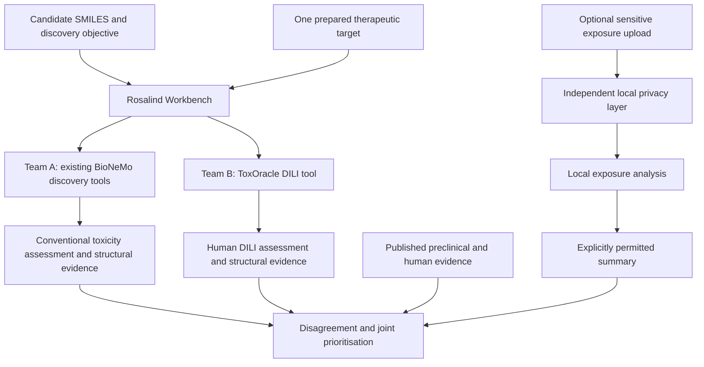

# ToxOracle: shared hackathon build plan

Date: 19 September 2026  
Audience: Team A (Rosalind discovery workflow) and Team B (human DILI model)  
Status: implementation guideline; revised to require a shared toxicity assessment and structural evidence from both streams. Model/endpoint choices must be frozen jointly at kickoff.

**19 September implementation update:** The user has promoted the standalone local
privacy gateway into this Team B build alongside the structure-only baseline. It
filters text/CSV/JSON before file handoff to either agent stream. The OFF toggle is
local preview only; exports require a completed scan and approval of the sanitized
snapshot. This supersedes the optional timing of privacy work below. Exposure-aware
training and live provider integration remain deferred. See
`docs/runbooks/team-b-local-mvp.md` for the implemented commands and boundary.

The user additionally approved explicit per-field retention of privacy-model false
positives only after scientific validation and local acknowledgement. Generic PII
redactions are not automatically reversible through this exception.

## 1. Product and definition of success

Build one researcher-facing workflow in which Rosalind uses existing BioNeMo tools to assess drug candidates, calls a separate ToxOracle model to predict human liver-toxicity concern, and combines the evidence into candidate priorities and recommended experiments.

**Primary demonstration:** Adding human DILI prediction changes which discovery candidates we prioritise and what experiments we recommend.

**Additional demonstration, when evidence supports it:** The model flags a documented human liver liability that a specified preclinical assay did not detect. Published assay results can supply this comparator; a separately trained preclinical model is not required.

The MVP predicts drug-level DILI concern, not individual patient outcomes, overall clinical success, or therapeutic efficacy. A recommendation for a 3D liver experiment is initially a transparent triage rule, not a trained prediction of experimental benefit.

### Required MVP

- A candidate list enters the workflow as compound IDs and SMILES.
- One defined discovery task runs using existing tools/models.
- Both streams return the same toxicity-assessment envelope: Team A supplies a conventional/preclinical assessment; Team B supplies a human DILI assessment. Both include provenance, reliability and structural evidence.
- A comparison layer computes the defined disagreement output when the inputs support it, and otherwise returns an explicit unavailable reason.
- The same candidate IDs appear in both outputs and the combined report.
- Users can compare discovery-only priorities with priorities after toxicity assessment.
- Recommendations explain which evidence supports the next experiment.
- Three cached cases and a complete saved walkthrough remain usable if live services fail.

### Stretch work, only after integration works

- Candidate generation, additional targets, or additional toxicity endpoints.
- Optional human exposure input through an independent local privacy boundary.
- Exposure-aware retraining, mechanistic proxy models, molecular foundation embeddings.
- Formal hallucination assessment or token-efficiency benchmarking.

## 2. Architecture and resource assumptions

The team has full hackathon access to Codex (Astra), GPT-Rosalind/Workbench, BioNeMo Agent Toolkit/models, and Brev GPUs. Ask for required credentials rather than assuming access is unavailable. Keep credentials outside the repository and artifacts.

Official documentation supports Rosalind as a scientific tool orchestrator and BioNeMo Agent Toolkit as tools/skills/interfaces to scientific models. NVIDIA reports OpenAI integration, but the exact tools enabled in this Workbench session must be checked. Do not assume a mandatory nested BioNeMo agent or an undocumented Workbench API.



The toxicity model is computationally separate but callable within the same researcher workflow. It does not need to be a BioNeMo model. Only Team B trains a model in the core plan; Team A integrates an existing toxicity predictor or sourced assay assessment in addition to discovery tools. If neither provides the required comparator, report the dependency as unresolved; do not substitute a binding score or reuse Team B's score. Fitting a new endpoint translation/calibration layer would be additional joint modelling work, not an assumed existing capability.

## 3. Ownership and handoffs

| Work item | Accountable team | Handoff |
|---|---|---|
| Workbench access, callable tool inventory and orchestration | A | Verified invocation path and one real tool result |
| Discovery objective, target preparation and reference ligand | A, with biologist | Target manifest and candidate fixture |
| BioNeMo execution and discovery evidence | A | Supplementary discovery metrics and poses |
| Conventional/preclinical toxicity comparator | A, with biologist | Shared toxicity assessment with exact endpoint and conditions |
| Structural evidence and atom mapping | Each team; shared identity policy | Aligned molecular graph, fragments/attributions, source artifacts |
| Comparison eligibility and disagreement computation | Joint | Versioned formula, status and reason |
| DILI data, structures, splitting, training and evaluation | B | Versioned model and evaluation report |
| Pretrained fallback assessment | B | Reproducible inference and documented training membership limitations |
| Toxicity tool interface | B | Prediction contract and working adapter/service |
| Historical preclinical-miss evidence | B, with biologist | Cited case records reviewed jointly |
| Combined report, before/after view and agent prompts | A | End-to-end researcher workflow |
| Triage rule and scientific claims | Joint | One agreed rule and claims checklist |
| Optional local privacy/exposure tool | B owns boundary; A consumes permitted result | No raw sensitive upload through Workbench |

At kickoff, each team names one integration contact. Team A owns the canonical candidate ID list. Team B returns those IDs unchanged. Neither team changes shared field names or meanings without notifying the other.

## 4. Team A: conventional discovery workflow

### Team A split for two people

| **Owner**                 | **Main responsibility**                                                                                     | **Files**                                                                    |
| ------------------------- | ----------------------------------------------------------------------------------------------------------- | ---------------------------------------------------------------------------- |
| Person 1 — Integration/UI | Contracts, orchestration, comparison logic, combined report, Team B integration                             | `contracts/`, `app/`, `tests/integration/`, `discovery/prompts/`, `demo/`    |
| Person 2 — NVIDIA/GPU     | Real BioNeMo/DiffDock execution, target preparation, conventional toxicity comparator, structural artifacts | `discovery/src/`, `discovery/configs/targets/`, `discovery/tests/`, `infra/` |

### 4.1A. Person 1: Integration and combined workflow

1. Implement or finalize the v2 request/response JSON schema.
2. Create valid, invalid, failed, and `not_run` fixtures.
3. Preserve `compound_id`, `structure_id`, and atom-map IDs across both streams.
4. Build the Team A batch/orchestration command.
5. Accept Team B’s toxicity JSON and join it with Team A output.
6. Implement comparison eligibility:
   - Same calibrated endpoint → numeric disagreement.
   - Different endpoints → call/cross-endpoint disagreement only.
   - Missing or failed assessment → explicit unavailable reason.
7. Implement discovery-only versus revised priority tables.
8. Produce the combined report and three cached demo cases.
9. Add integration tests for invalid SMILES, missing records, ID mismatches, and tool failure.

### 4.1B. Person 2: NVIDIA/GPU and scientific execution

1. Inventory the actual NVIDIA/BioNeMo tools and record versions.
2. Run one real BioNeMo request immediately.
3. With the biologist, freeze:
   - Therapeutic target and species.
   - PDB structure, chain, cofactors, and preparation.
   - Reference ligand.
   - Small candidate set and controls.
4. Run DiffDock or the selected discovery tool.
5. Save poses, confidence values, prepared structures, logs, checksums, and provenance.
6. Select and run an existing conventional/preclinical toxicity comparator.
7. Return Team A’s v2 assessment envelope.
8. Export atom-mapped structures, pose artifacts, and real contacts where available.
9. Clearly mark unsupported toxicity attribution as unavailable.

The NVIDIA-access person should concentrate on the real BioNeMo/DiffDock execution and artifacts. Team A should not use that GPU to train the human DILI model—that belongs to Team B.

### Work together first

Spend the first hour jointly freezing:

- Candidate IDs and canonical structures.
- Target and discovery criterion.
- Conventional toxicity endpoint.
- Same-endpoint versus cross-endpoint comparison mode.
- Exact v2 contract expected from Team B.
- File naming and artifact handoff locations.

Ask Team B for a labelled `not_run` mock response immediately. Person 1 can integrate against it while Person 2 runs the real NVIDIA workflow.

### Suggested order

**First 3 hours**

- Person 1: contracts, fixtures, join skeleton.
- Person 2: tool inventory, target manifest, first real BioNeMo run.

**Hours 3–6**

- Person 1: comparison and priority logic.
- Person 2: batch discovery adapter and conventional comparator.

**Hours 6–10**

- Replace mocks with real Team A and Team B results.
- Validate identities and structural mappings.
- Create the first complete combined report.

**Final phase**

- Three cached cases.
- Failure-mode tests.
- Reproducible commands and runbook.
- Claims audit and demo rehearsal.

Cut generation, extra targets, exposure processing, and UI polish if time becomes tight.

### Working directly on `main`

The repository recommends short-lived branches, but if both of you must use `main`, use strict directory ownership:

- Person 1 does not modify `discovery/src/` while Person 2 is working there.
- Person 2 does not modify `contracts/` or `app/` without coordinating.
- Pull before each work block and before pushing.
- Make small commits with descriptive messages.
- Announce any shared-schema change before committing it.

Your minimum Team A completion condition is: one real BioNeMo result, one real conventional toxicity assessment, a valid v2 discovery envelope, a successful join with Team B, and a before/after candidate-priority report.

### A1. Verify the actual execution path

1. Inspect the Workbench's available scientific tools and supported custom-tool connection mechanism.
2. Run one real BioNeMo request and save the tool/model version, input, output, and artifact paths.
3. Verify how the toxicity callable can be reached. Use a supported tool connector or adapter. Do not design around assumed Workbench endpoints.
4. If a direct connection cannot be completed in time, use a reproducible file handoff: export candidates, run Team B's batch command, and import its result into Workbench. Label this as a manual integration step in the demo.

### A2. Freeze one discovery task

Default: assess a small candidate set against one therapeutic protein. The biologist supplies:

- Target name, species, UniProt ID if available, and intended biological action.
- A suitable PDB entry/file, relevant chain/domain, and essential cofactors or structural constraints.
- A known reference ligand, preferably in an experimental complex.
- Candidate SMILES; known controls if available.

Prepare the target once. Store the preparation choices and reference identifiers in a target manifest. The target need not be a liver protein: liver toxicity is the safety assessment across candidates.

DiffDock is a concrete option for ligand poses from protein PDB plus ligand SMILES/SDF. Its pose confidence is not affinity or efficacy. If using another scorer for candidate ranking, retain its name, units, direction, and interpretation. Do not rank therapeutic promise solely by comparing pose confidence across compounds.

If only docking is available, present pose plausibility and calculated molecular properties, with a clearly labelled provisional discovery rubric agreed with the biologist. If no defensible ranking is available, keep candidates unranked and demonstrate how toxicity changes the follow-up shortlist.

### A3. Add the conventional toxicity assessment

This is now a required Team A output, alongside the conventional discovery outputs. At kickoff, identify an existing model/tool or a documented experimental result for a specified liver-relevant endpoint. Do not assume the selected BioNeMo docking/generation tool supplies toxicity predictions.

Preferred numerical comparison: an existing conventional predictor estimates the same drug-level human DILI label used by Team B, using its own conventional evidence/features. Both models must have compatible label definitions and assessed calibration. This produces **model discordance**, not direct proof of an experimental preclinical miss.

If the available comparator predicts a different endpoint (for example, hepatocyte viability or mitochondrial toxicity), retain that exact endpoint and its species, cell system, dose/concentration and duration. Compare thresholded calls as **cross-endpoint discordance**; do not subtract its raw score from human DILI probability. A measured result may supply the call without a probability. Missing assay data are not negative results.

For structure-only inference on new candidates, Team A needs a predictor that accepts structure. A literature lookup can support named historical cases but is not a predictor for novel compounds. Freeze this availability distinction before promising the demo scope.

### A4. Deliver primary and supplementary evidence

- Primary: the common toxicity assessment and structural evidence contract in section 6.
- Supplementary: therapeutic target, named discovery scores/units, generated molecules if used, pose artifacts, interaction annotations if computed, and discovery priority with its explicit rule.
- Structural output: shared atom-mapped molecular graph plus any actual docked ligand SDF/protein PDB artifacts, pose confidence, and atom-to-residue contacts. Mark the protein as a therapeutic target or a toxicity-related target; therapeutic docking alone does not explain liver toxicity.
- If the comparator supports feature attribution or validated structural alerts, return affected fragments/atoms, attribution method and source. Otherwise mark attribution unavailable; retain the molecular graph and available structural artifacts.

Optional GenMol generation comes after the screening flow works. Its generated SMILES must go through the same validation and toxicity pipeline as uploaded molecules.

## 5. Team B: human DILI model

### B1. Assemble the minimum dataset

Start with FDA **DILIrank 2.0**, then attach verified chemical structures. Proposed binary target:

- Positive: Most-DILI-concern and Less-DILI-concern.
- Negative: No-DILI-concern.
- Exclude Ambiguous-DILI-concern initially; preserve original categories.

The FDA lists 1,336 entries, of which 982 are non-ambiguous before structure matching and filtering. Do not report 982 as the final training count. Restrict the first model to suitable small molecules; record excluded biologics, mixtures, unmatched structures and other exclusions.

Minimum curated fields:

```text
compound_id,compound_name,canonical_smiles,structure_key,
original_dili_category,dili_label,label_source,structure_source
```

Use a documented standardisation policy for salts, parent compounds and duplicates. Keep the mapping to source entries. Resolve conflicting labels explicitly. Label sections and severity annotations are provenance/targets, not predictive input features.

### B2. Freeze evaluation before training

- Assign compound groups to training, validation and test partitions before model fitting.
- Prefer a scaffold-disjoint split if class coverage permits; otherwise use a compound-disjoint split and report the limitation.
- Reserve intended unseen demonstration cases before feature selection, tuning or training.
- Fit preprocessing, feature selection, calibration and decision thresholds without test labels.
- Keep all forms/replicates of the same compound together according to the documented grouping policy.
- If using auxiliary pretrained predictors, inspect their training overlap with the evaluation set too.

### B3. Train the simplest credible model

Default first implementation: Morgan fingerprints (radius 2, 2,048 bits) into a random forest classifier. Use a small, fixed tuning budget. A logistic regression baseline is useful if time permits; do not delay integration for an architecture search.

The user supplies SMILES only. Features are computed internally. BioNeMo embeddings and Seal-style predicted proxy features are extensions, not mandatory inputs.

Expose an uncalibrated output as a **model score**. Use **probability** only when calibration has been assessed appropriately. In either case, the target is drug-level DILI concern, not the incidence of liver injury in patients.

Minimum evaluation report:

- Final counts, class balance, exclusions and split procedure.
- AUROC, average precision, sensitivity, specificity, and confusion matrix at a validation-selected threshold.
- Calibration/Brier assessment if presenting probabilities.
- A clearly explained applicability indicator, such as nearest-training-compound fingerprint similarity. Similarity is not a confidence probability.
- Test-set limitations and model/training-data versions.

Do not invent a confidence interval. Use a documented uncertainty method if implemented; otherwise return `null` with a reason and retain the applicability information.

### B4. Fallback without changing the interface

If the curated dataset/model cannot be completed, integrate a published pretrained predictor. Seal's DILIPredictor is a candidate to inspect; Eltahir's MultiEndpointTox is another reference, with the supplied version being a preprint.

Before relying on a fallback, verify its actual code/artifacts, dependencies, input format, permitted use, reproducible inference, output meaning and available training identifiers. Do not copy paper performance numbers into the evaluation of this implementation.

Mark model origin `pretrained`. If case membership is unknown, mark it `unknown` and describe the example as retrospective illustration. The same prediction contract must work for trained and pretrained models.

### B5. Deliver structural evidence

Return the same atom-mapped molecule used by Team A, along with model-supported fragment/feature evidence where available. For the fingerprint baseline, retain the fingerprint configuration and bit-to-atom-environment mapping during featurisation. An attribution method may rank feature contributions, then map them to candidate fragments.

Record the attribution target, method/version, baseline/reference and output scale. Hashed fingerprint bits may map to multiple environments: return all matching environments and an ambiguity flag rather than claiming a unique toxic atom. Global descriptor contributions remain global; do not force them onto atoms. A fallback model without explanation support must return an explicit unavailable status.

A 2D atom-mapped graph with highlighted supported fragments is a valid structural output. Do not fabricate a 3D toxicity structure. Model attribution supports mechanistic hypotheses, not causal proof.

## 6. Shared interface: consistent assessments and structural outputs

Both teams implement a batch callable returning schema version `2.0`. Team A returns `stream: discovery`; Team B returns `stream: toxicity`. JSON files remain the guaranteed fallback; HTTP/Workbench adapters wrap the same records. This replaces the earlier asymmetric v1 contracts.

### Shared request

```json
{
  "schema_version": "2.0",
  "request_id": "demo_run_01",
  "compounds": [
    {
      "compound_id": "candidate_001",
      "canonical_smiles": "CCO",
      "atom_mapped_smiles": "[CH3:1][CH2:2][OH:3]",
      "structure_id": "example_structure_v1",
      "standardization_version": "example_policy_v1"
    }
  ]
}
```

The molecule is a schema example, not a nominated candidate. Shared preprocessing assigns the standardised structure, stable structure ID and atom-map IDs once. Both teams preserve them. Any internal salt/protonation/conformer transformation must retain a mapping back to these IDs and disclose unmapped atoms. Do not silently join different parent structures. Require unique candidate IDs and return a record for every input, including failures.

### Common per-compound response

This Team B example contains no computed scores. Team A uses the identical core fields, its own endpoint/method metadata, and `stream: discovery`.

```json
{
  "schema_version": "2.0",
  "request_id": "demo_run_01",
  "stream": "toxicity",
  "results": [
    {
      "compound_id": "candidate_001",
      "structure_id": "example_structure_v1",
      "status": "not_run",
      "assessment": {
        "endpoint_id": "human_dili_binary_v1",
        "positive_definition": "Most or Less DILI concern",
        "negative_definition": "No DILI concern",
        "context": {"species": "human", "system": "drug_level_annotation", "conditions": null},
        "evidence_type": "model_prediction",
        "risk_score": null,
        "score_kind": "uncalibrated_score",
        "direction": "higher_is_more_toxic",
        "threshold": null,
        "call": "unavailable",
        "calibration": {"status": "not_assessed", "reference": null},
        "uncertainty": {"method": "not_implemented", "value": null},
        "applicability": {"method": "nearest_train_tanimoto", "value": null}
      },
      "structural_evidence": {
        "canonical_smiles": "CCO",
        "atom_mapped_smiles": "[CH3:1][CH2:2][OH:3]",
        "standardization_version": "example_policy_v1",
        "attribution_status": "unavailable",
        "attribution_method": null,
        "attribution_target": null,
        "attribution_scale": null,
        "attribution_reference": null,
        "fragments": [],
        "structure_artifacts": [],
        "interactions": [],
        "mechanism_hypotheses": []
      },
      "supplementary_metrics": [],
      "provenance": {
        "method_id": "toxoracle_dili_v1",
        "model_origin": "trained",
        "data_version": "curated_dilirank2_v1",
        "training_membership": "unknown",
        "evidence_refs": []
      },
      "warnings": ["Schema example; inference has not run"],
      "error": null
    }
  ]
}
```

Contract rules:

- `status`: `ok`, `invalid_input`, `unsupported`, `failed`, `not_run`. Failure never becomes low risk.
- `risk_score`: finite 0–1 model score/probability when supported; otherwise null. Never min-max scale arbitrary assay measurements to imply probability. Retain raw assay values and units in supplementary metrics.
- `score_kind`: `calibrated_probability`, `uncalibrated_score`, or `unavailable`. `call`: `positive`, `negative`, or `unavailable`; record the threshold or source assay positivity rule.
- `evidence_type`: `model_prediction` or `measured_assay`. Measured binary calls do not become certain 0/1 probabilities.
- Each supplementary metric has `name`, `value`, `unit`, `direction`, `meaning`, and `source_ref`. Discovery examples include pose confidence/properties; toxicity examples include auxiliary endpoint scores or exposure margins.
- Each fragment has `fragment_id`, `atom_map_ids`, `pattern` (if available), `contribution`, `evidence_kind`, `source_ref`, and `mapping_ambiguous`. Specify whether contribution is an attribution, a structural alert or a perturbation result; these are not interchangeable. Contributions from different methods are not directly comparable.
- Each structure artifact has `artifact_id`, `format`, `uri`, `checksum`, `origin` (experimental/predicted/generated), `atom_mapping_ref`, and relevant model/target/conformer identifiers.
- Each interaction has ligand `atom_map_ids`, protein target/chain/residue identifiers, `interaction_type`, `distance_angstrom` where available, and `artifact_ref`.
- Each mechanism hypothesis has `claim`, supporting `evidence_refs`, `evidence_level` and `proposed_validation`. Unsupported arrays stay empty with a reason in warnings.

### Comparison and combined scores

The joint layer checks compound/structure identity, endpoints, conditions, score type, calibration and availability before selecting a comparison mode. It returns `comparison_mode`, `status`, `reason`, both source assessment references, `formula_version`, and the following nullable results:

| Output | Definition | When allowed |
|---|---|---|
| `signed_disagreement` | `p_human - p_conventional` (range -1 to +1) | Same human DILI endpoint/label definition, compatible assessment context and assessed calibration on a common reference population |
| `absolute_disagreement` | `abs(signed_disagreement)` | Same eligibility as signed disagreement |
| `call_disagreement` | 1 if calls differ, otherwise 0 | Both endpoint-specific calls available; identify same-endpoint versus cross-endpoint mode |
| `hidden_liability_flag` | 1 if conventional call is negative and human call is positive, otherwise 0 | Both calls available; a potential liability, not confirmed human toxicity |
| `conservative_risk_score` | `max(p_human, p_conventional)` | Same eligibility as signed disagreement; label as a triage heuristic, not a calibrated combined probability |

Positive signed disagreement means the human model assigns higher concern. For illustration only, 0.80 minus 0.25 is +0.55 (+55 percentage points). Even same-endpoint disagreement is not the probability of translational failure.

For different endpoints or uncalibrated scores, signed/absolute disagreement and conservative risk remain null. Return thresholded discordance with exact endpoint names; shared JSON shape and 0–1 scales alone do not make quantities comparable. If either call is missing, call-based scores are null too. Never substitute docking confidence for toxicity.

**Kickoff decision:** prefer a same-endpoint conventional predictor if available and evaluable. Otherwise use a documented preclinical endpoint with categorical cross-endpoint discordance. This still gives both streams consistent outputs and an executable comparison, without manufacturing probabilities. Do not train an additional translation model unless the teams explicitly expand scope and have matched labels.

### Structural explanation handoff

The joint report aligns atoms/fragments by shared map IDs and shows evidence from each stream side by side. Keep the chain explicit: highlighted fragment or interaction → model/assay evidence → mechanism hypothesis → proposed experiment. Attributions explain model behaviour; a docking contact shows a predicted interaction. Neither establishes that a fragment causes human DILI. Later causal investigation may use controlled matched molecular pairs, targeted assays or other intervention evidence. Generated counterfactual score changes alone remain model sensitivity evidence.

## 7. Prioritisation and researcher output

Agree the discovery criterion with the biologist and the DILI threshold from validation. Use a versioned, explicit policy:

| Discovery evidence | DILI/reliability evidence | Initial recommendation |
|---|---|---|
| Promising by agreed criterion | Elevated concern, credible applicability | Consider targeted human-relevant liver validation before advancement |
| Promising | Uncertain or outside supported chemical space | Gather safety evidence; consider an assay that resolves the uncertainty |
| Promising | Lower predicted concern | Continue planned evaluation; do not label safe |
| Weak | Elevated concern | Deprioritise unless other evidence justifies further work |
| Any | Toxicity tool failed | Assessment incomplete; retry or review |

High toxicity alone does not establish that a costly 3D experiment is worthwhile. Include therapeutic promise, uncertainty and whether the result could change the decision.

Return a table with candidate, conventional toxicity assessment, human DILI assessment, comparison mode/disagreement, reliability, supplementary discovery evidence, original priority, revised priority and next experiment. Add an atom-mapped structure view with fragment highlights and source links from both streams. Add a candidate detail view with artifacts and sources. An agent narrative must be generated from these records, not used to invent quantitative results.

For experiments, name the question, relevant assay/model and proposed readouts. Mechanistic claims require evidence; fingerprint feature attribution alone does not establish a biological mechanism. If mechanism evidence is absent, recommend broader liver-safety characterisation and say why.

### Joint evaluation of assessments and explanations

- For predictors of the same human DILI target, report each stream's AUROC, average precision, sensitivity/specificity and calibration on the same held-out compounds where feasible. Assess calibration on compatible reference data; separate source training overlap from evaluation membership.
- For different targets, evaluate each against its own ground truth. Do not claim that accuracy on one assay measures human DILI accuracy.
- Report comparison coverage: eligible scored pairs / submitted compounds, plus reasons for exclusions. Unavailable comparisons must not count as agreement.
- Report call-disagreement rate on available pairs. This describes disagreement, not correctness.
- On a defined held-out cohort with measured preclinical calls and human labels, report recovery of assay-negative/human-positive cases and false-positive rate among assay-negative/human-negative controls. Use this to assess whether prioritisation helps.
- Check that atom references resolve to the shared molecule, artifact mappings survive preparation, and every structural claim has a source. Report attribution coverage; unsupported explanations remain unavailable. Perturbation checks, if used, assess model sensitivity rather than causality.

## 8. Historical preclinical-miss cases

Team B and a biologist curate a small evidence file. For each case record:

```text
compound_id, canonical_smiles,
preclinical_assay, species_or_cell_system, concentration_and_duration,
reported_result, positivity_definition, assay_source_and_locator,
human_DILI_evidence, human_source_and_locator,
model_training_membership, held_out_prediction, interpretation_limitations
```

Require an actual negative/not-flagged result, not an absence of published testing. Name the assay and conditions. A historical failure, late withdrawal or DILI-positive label alone does not establish that preclinical screening missed it.

Claim levels:

1. **Integrated product:** the model changes follow-up priorities. Supported by the working pipeline and transparent before/after comparison.
2. **Retrospective illustration:** a model flags a documented miss, but training membership is included/unknown. State that limitation.
3. **Held-out case:** a model flags a documented miss excluded from training and tuning. Supports a case-level result.
4. **General performance claim:** requires a suitable evaluated cohort, including negatives, with held-out metrics and limitations.

Do not keep searching for attractive cases after inspecting the test results and present them as a prespecified evaluation. Report case selection honestly. Use section 6 comparison modes; the MVP must report numeric model discordance when eligible, categorical cross-endpoint discordance otherwise, or an explicit unavailable reason. A confirmed preclinical-miss claim still requires human outcome evidence.

## 9. Optional exposure and privacy branch

Only start after the core integration milestone. Keep sensitive raw data outside Workbench, external prompts, remote tool payloads, telemetry and logs. Brev is remote compute; it is not automatically inside a local-data boundary.

Minimum optional input: compound ID, scenario ID, Cmax value/unit, total or unbound basis, provenance, and regimen context where available. Use synthetic/public examples to demonstrate the boundary first.

The independent local component validates a structured schema, rejects unsupported fields and releases only an explicitly permitted result. Removing names alone is not sufficient evidence that subject-level data are safe to transmit.

Without matched exposure training data, keep the DILI prediction unchanged. If a suitable toxicity concentration is available, return an endpoint-specific exposure margin with units, concentration basis, assay conditions and assumptions. Missing toxicity concentration means no margin can be calculated. Do not generate one from Cmax alone.

An exposure-aware DILI probability requires training and evaluation using compatible exposure features. Treat this as a separate model version.

## 10. Relative build schedule and integration gates

Use these as timeboxes from kickoff; compress proportionally if less than a day remains.

| Time | Team A | Team B | Joint gate |
|---|---|---|---|
| 0–1 h | Verify tools; choose task/target and toxicity comparator | Confirm data/pretrained path | Freeze v2 contract, atom mapping, endpoint definitions and comparison mode |
| 1–3 h | Run discovery and comparator calls | Curate initial data; provide labelled v2 mock response | Join both envelopes and structural IDs |
| 3–6 h | Build structured discovery output | Train first baseline or run fallback; begin case curation | Replace mock with real toxicity inference |
| 6–10 h | Connect comparator, structural artifacts and combined report | Freeze model/threshold; export fragment evidence; evaluate | Real run with eligible disagreement or explicit fallback mode |
| 10–16 h | Before/after priorities and artifact display | Reliability report and case evidence | Verify claims and recommendation logic |
| Final 2–3 h | Cache, rehearse and record | Freeze model/results | Three cases, backup workflow, pitch audit |

If integration slips, cut generation, extra targets, exposure and UI polish first. Preserve real discovery execution, real toxicity inference and traceable recommendations. Do not spend the final hours searching for a better dataset.

## 11. Suggested repository organisation

The directory scaffold is now created; see `docs/repository.md` for the full tree and `CONTRIBUTING.md` for workflow conventions. These locations reserve responsibilities; runnable components and execution commands remain implementation deliverables.

```text
contracts/             shared schemas and valid/invalid fixtures
discovery/             Team A tool adapters and workflow instructions
toxicity/              Team B feature pipeline, training and inference
data/manifests/        source, mapping, exclusion and split manifests
evaluation/            metrics, calibration and applicability reports
cases/                 cited historical case records
demo/                  permitted cached requests/results and walkthrough
docs/                  setup, target preparation and model notes
```

Keep restricted datasets, credentials and large model artifacts out of Git. Each team supplies a reproducible setup and execution command in its README. Pin dependencies/model versions and record artifact locations/checksums as appropriate. Share mocks early, clearly marked `not_run`; never leave mock scores in the final demonstration.

## 12. Final acceptance checklist

- [ ] Candidate IDs survive both branches and the join without mismatches.
- [ ] Real BioNeMo discovery, conventional toxicity assessment and human DILI inference run.
- [ ] Both streams emit v2 assessment and structural-evidence envelopes with matching structure/atom IDs.
- [ ] Comparison eligibility is checked; formulas and cross-endpoint/unavailable modes are displayed correctly.
- [ ] Each stream returns a molecular graph and available source-backed structural/fragment evidence; absent attribution is explicit.
- [ ] Structural hypotheses are distinguishable from causal evidence.
- [ ] Invalid SMILES, unsupported compounds and a tool failure are handled visibly.
- [ ] Every score has a defined meaning and model/source provenance.
- [ ] Model evaluation uses appropriate held-out compounds; pretrained overlap is disclosed.
- [ ] Before/after priorities use the same candidates and an explicit policy.
- [ ] At least one recommendation states what experiment would resolve which uncertainty.
- [ ] Preclinical-miss claims have both assay and human evidence and a membership label.
- [ ] Sensitive inputs, if supported, never enter external systems before the local boundary.
- [ ] Three permitted cached cases and a backup recording/report are ready.
- [ ] Both teams can follow the setup instructions and reproduce their part.

## 13. Reference starting points

- [FDA DILIrank 2.0](https://www.fda.gov/science-research/liver-toxicity-knowledge-base-ltkb/drug-induced-liver-injury-rank-dilirank-20-dataset): human label definitions and source table.
- [Rosalind Workbench](https://developers.openai.com/blog/rosalind-workbench): scientific orchestration and tool connection context.
- [BioNeMo Agent Toolkit workflow](https://developer.nvidia.com/blog/build-an-ai-scientist-for-life-science-discovery-with-nvidia-bionemo-agent-toolkit/): agent-callable skills/models and deployment choices.
- [NVIDIA integration announcement](https://nvidianews.nvidia.com/news/nvidia-launches-bionemo-agent-toolkit-giving-ai-agents-the-tools-to-accelerate-scientific-discovery): OpenAI integration context, not proof of session configuration.
- [DiffDock model card](https://docs.api.nvidia.com/nim/reference/mit-diffdock): input/output semantics.
- [GenMol endpoint documentation](https://docs.nvidia.com/nim/bionemo/genmol/2.0.0/endpoints.html): optional generation branch.
- `refs/papers/Seal(2024).pdf`: structure-only inference using predicted proxy/PK features; inspect accompanying implementation before reuse.
- `refs/papers/Eltahir(2026).pdf`: multi-endpoint structure-based approach; supplied version is a preprint.
- `refs/papers/Ewart(2022).pdf` and `refs/papers/Bergen(2025).pdf`: potential experimental-context and case-evidence sources; verify the exact assay/compound claims.

The present plan supersedes the earlier sketches for the agreed first-build scope: **existing discovery tools plus an existing conventional toxicity comparator and one additional human DILI model**, with consistent assessment/structural outputs and an explicit comparison layer. Published preclinical evidence supports case studies and can supply comparator calls for named compounds.
