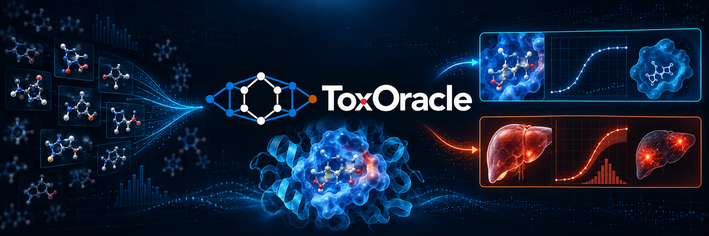

<p align="center">
  
</p>

<h1 align="center">ToxOracle</h1>

<p align="center">
  <strong>Design for promise. Screen for risk.</strong><br />
  An agentic drug-discovery workflow that adds human liver-toxicity evidence before a promising molecule becomes an expensive mistake.
</p>

<p align="center">
  Built for the London AI × Bio Hackathon · ABL1 demo · MIT licensed
</p>

<p align="center">
  <a href="https://toxoracle-demo.vercel.app"><strong>Launch the interactive demo →</strong></a>
  &nbsp;&nbsp;·&nbsp;&nbsp;
  <a href="docs/runbooks/public-demo.md">Demo guide</a>
  &nbsp;&nbsp;·&nbsp;&nbsp;
  <a href="BUILD_PLAN.md">Build plan</a>
</p>

---

<table>
  <tr>
    <td align="center" width="25%"><strong>🧬 GENERATE</strong><br /><sub>40 proposals<br />29 acceptable unique molecules</sub></td>
    <td align="center" width="25%"><strong>🎯 DISCOVER</strong><br /><sub>20 screened candidates<br />18 successful predictions</sub></td>
    <td align="center" width="25%"><strong>🛡️ ASSESS</strong><br /><sub>Local human DILI evidence<br />kept separate from binding</sub></td>
    <td align="center" width="25%"><strong>🔬 DECIDE</strong><br /><sub>2 frozen finalists<br />2 held for liver validation</sub></td>
  </tr>
</table>

## One question. Two kinds of evidence. A better next experiment.

ToxOracle turns an ABL1 research question into a traceable candidate study. GenMol proposes molecules, BioNeMo Boltz-2 ranks their predicted binding, and a separate local model adds drug-level human DILI concern. The workflow then shows how the liver-safety signal changes the next experiment—without pretending binding and toxicity are the same endpoint.

The public experience replays a reviewed real run: **40 generated proposals → 29 acceptable unique molecules → 20 screened candidates → 2 shortlisted candidates held for liver validation**.

### Why it is different

- **Discovery and safety stay separate.** Binding likelihood is never subtracted from DILI concern or collapsed into a made-up “overall” score.
- **Safety changes the decision, not the science.** The discovery shortlist is frozen before DILI inference, so the before/after follow-up is visible and auditable.
- **Evidence survives the workflow.** Candidate identity, score arrays, ranks, model provenance, failures, training membership, applicability similarity, and saved poses remain inspectable.
- **The demo is honest about its boundaries.** Recorded results are labelled, failed candidates remain visible, and predictions are never presented as proof of efficacy or human safety.

## Try the complete experience

### **[Launch the interactive ToxOracle demo →](https://toxoracle-demo.vercel.app)**

No login, API key, model download, or running laptop required.

The static demo includes the target-only generation study and the frozen four-drug supplied panel. You can replay the research flow, inspect the shortlist, compare binding with DILI concern, explore molecular features, rotate all 22 available saved poses, and download the reviewed reports.

> **Recorded demo, real saved evidence.** New prompts and candidate sets require the local researcher app. The hosted site does not run inference or transmit visitor inputs.

## How it works

```mermaid
flowchart LR
    Q[Research question] --> P[Local privacy review]
    P --> G[GenMol candidates]
    G --> B[BioNeMo Boltz-2]
    B --> S[Frozen top-2 shortlist]
    S --> D[Local human DILI model]
    D --> R[Before / after report]

    classDef input fill:#eef6ff,stroke:#0066b3,color:#08233d
    classDef discovery fill:#dff4ff,stroke:#0089c7,color:#08233d
    classDef safety fill:#fff0e8,stroke:#d96622,color:#48210c
    classDef output fill:#e8edf8,stroke:#193a6a,color:#102340
    class Q,P input
    class G,B,S discovery
    class D safety
    class R output
```



| Stage | What happens | What is preserved |
|---|---|---|
| **Generate** | GenMol proposes fragment-derived ABL1 candidates | seeds, settings, proposal ledger, rejection reasons |
| **Discover** | Boltz-2 predicts complexes and binding evidence | raw score arrays, rank, structure confidence, saved poses |
| **Assess** | the local ToxOracle model estimates human DILI concern | calibrated score, threshold, training membership, feature evidence |
| **Decide** | a provisional policy recommends the next experiment | discovery-only decision, safety-informed decision, limitations |

NVIDIA Nemotron 3.5 Lightning provides bounded planning and explanation after local approval. It cannot change scientific settings, thresholds, shortlist membership, or computed records.

## Run locally

The standalone researcher workspace owns prompt entry, privacy review, approval, execution progress, and results.

```bash
python3 -m venv app/.venv
app/.venv/bin/python -m pip install -r app/requirements-web.lock -e app -e discovery
PYTHONPATH=app/src:discovery/src:. app/.venv/bin/python -m toxoracle_app.web
```

Open **http://127.0.0.1:8766**. Browsing existing reports works locally; executing a new study also requires the prepared scientific environment, trained DILI artifact, privacy checkpoint, and provider credentials. No models are trained or downloaded at startup.

For the complete setup and recovery path, see the [research workspace runbook](docs/runbooks/research-workspace.md).

### Command-line workflow

```bash
# Check the frozen supplied-panel workflow
./scripts/toxoracle-screen preflight \
  --request demo/examples/abl1_request.json \
  --target discovery/configs/targets/abl1.json \
  --output-dir artifacts/runs/my-abl1-screen

# Check target-only generation and screening
./scripts/toxoracle-design preflight \
  --request demo/examples/abl1_design_request.json \
  --output-dir artifacts/runs/my-abl1-design
```

Use the [ABL1 generation runbook](docs/runbooks/target-only-generation.md) and [screening runbook](docs/runbooks/rosalind-screening.md) before a live or cached execution. The runbooks document credentials, immutable output directories, resume safeguards, and exact-cache behaviour.

## Verified demonstration

The main reviewed study completed with two live GenMol batches, 20 live Boltz-2 candidate predictions, a separate reference check, and local DILI inference for every screened candidate. A cache-only replay reproduced candidate identities, selection, ranks, follow-up decisions, and DILI outputs. The supplied four-drug study also completed.

The static deployment is independently packaged and was verified anonymously: all **567 scientific and UI assets** matched the tested build, and all **22 available poses** rendered in Chrome. See the [public-demo evidence](evaluation/reports/static_public_demo_v1.json) and [generation-workflow evidence](evaluation/reports/generation_workflow_v1.json).

## Scientific scope

ToxOracle is a research-prioritisation system, not a clinical decision tool.

- The current prepared target is the human **ABL1 kinase domain** (PDB **2HYY**, UniProt **P00519**).
- The DILI model estimates drug-level human liver-toxicity concern learned from DILIrank 2.0; it does not predict dose, exposure margin, patient-level outcome, or efficacy.
- Generated structures have no measured outcome labels. Their predictions are not prospective validation.
- A lower DILI score does not establish safe human exposure. A strong binding prediction does not establish therapeutic efficacy.
- The shortlist and follow-up policy are provisional and require experimental validation.

Read the [model card](toxicity/model_cards/dili_baseline_v1.md) for performance, calibration, applicability, and limitations.

## Project map

| Area | Purpose |
|---|---|
| [`discovery/`](discovery/) | GenMol and Boltz-2 adapters, target preparation, orchestration |
| [`toxicity/`](toxicity/) | DILI curation, features, evaluated model, inference |
| [`privacy/`](privacy/) | local filtering, review, approval, and audit boundary |
| [`app/`](app/) | researcher workspace, report rendering, presentation UI |
| [`contracts/`](contracts/) | versioned discovery, toxicity, and combined-report schemas |
| [`demo/`](demo/) | reviewed examples and public static recordings |
| [`evaluation/`](evaluation/) | model evaluation and machine-readable acceptance evidence |

The discovery and toxicity systems communicate through versioned contracts; neither imports the other’s vendor or training internals. See the full [repository map](docs/repository.md).

## Development

Run the offline pre-push suite:

```bash
PATH="$PWD/toxicity/.venv/bin:$PATH" ./scripts/check.sh
```

Ordinary tests do not call external services or download weights. Live provider, GPU, scientific-dependency, and browser acceptance checks are separate and must be recorded when run.

Contributions are welcome. Start with [CONTRIBUTING.md](CONTRIBUTING.md), keep changes focused, and preserve the repository’s evidence and artifact boundaries.

## License

[MIT](LICENSE) © 2026 the ToxOracle contributors.
