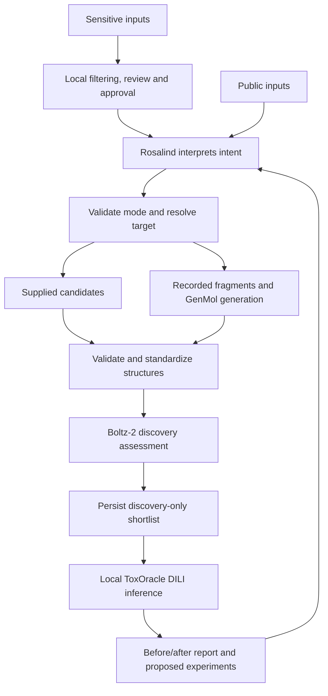

# Target-only generation and shared screening plan

Date: 19 September 2026. Implementation started 20 September 2026 (London).
Status: implemented; acceptance evidence and remaining gates are in
`docs/runbooks/target-only-generation.md`.
Branch: `feat/target-only-generation`, based on local `main` at
`2db1d7361bbc6e32d11d82d895b41c686301d152`.

## Objective and development boundary

Support two Rosalind-orchestrated workflows: screen supplied candidates against a
target, or generate candidates from a target and then screen them. Both show the
discovery-only shortlist before adding human DILI concern and recommended
experimental follow-up. Decisions may change; no change is also a valid result.

The first advanced release supports human ABL1 and small molecules. The user need
not supply molecules, but the workflow must resolve and record its target,
generation inputs and protocol. Generated structures are proposals, not established
drug candidates. This is discovery assessment with added liver concern, not a
complete conventional development pipeline or proof of a preclinical miss.

Teammates continue the frozen MVP demo described in `BUILD_PLAN.md`. Preserve its
command, four-compound panel, settings, model artifact, threshold and saved outputs.
Use this feature branch and separate run directories for advanced work. Coordinate
shared-interface changes before merging. The user subsequently authorized implementation.

## Architecture

Continue using Rosalind's local shell integration. Add an advanced command; a new
MCP server is not required. Sensitive input must pass the independent local gateway
before reaching hosted Rosalind or NVIDIA. The gateway remains an explicit file
handoff, not a transparent interceptor. Preserve OFF-mode restrictions and per-field
retention acknowledgements. PII filtering does not authorize external disclosure of
proprietary chemistry. Public inputs can enter directly.

## Routing and request contract

Rosalind interprets intent and proposes a structured request. Deterministic code
validates the request, controls stage transitions and enforces budgets.

| Intent | Mode | Behaviour |
|---|---|---|
| Screen these molecules against ABL1 | `screen` | Require candidates and a resolved target |
| Generate molecules against ABL1 | `generate_screen` | Resolve generation strategy and limits |
| Generate analogues of these molecules | `generate_screen` | Treat supplied structures as seeds |
| Find candidates for ABL1 | Unresolved | Clarify known-compound retrieval versus generation |
| Screen, but candidates are absent or invalid | Invalid | Request correction; never silently generate |

Record mode, target manifest/version, candidate or seed references, generation
strategy, requested count, attempt/scoring budgets, shortlist size, protocol version
and public/approved input provenance. Show a concise execution summary; ask only for
material ambiguity or required authorization. Presence of a file alone does not
determine mode. Do not expose arbitrary endpoints or shell commands as user fields.

Initially map ABL1 to a versioned human sequence/domain/variant manifest. Do not
silently substitute wild type for a named mutant. Other targets return a clear
preparation requirement. Small-molecule modality is explicit: the DILI baseline
does not support protein therapeutics.

## Model selection and target relevance

| Component | Initial choice | Purpose |
|---|---|---|
| Generation | GenMol NIM | Fragment-conditioned molecular proposals |
| Discovery | Existing Boltz-2 adapter | Complex, binder-likelihood and affinity evidence |
| Human liver concern | Existing local DILI baseline | Unchanged model, v2 outputs and threshold |
| Later optional docking | DiffDock | Pose evidence against a prepared receptor |
| Later alternative generation | MolMIM | Seed-based analogue exploration |

GenMol accepts molecular SAFE representations, not simply a target name. Prepare a
reviewed ABL1 seed/fragment manifest with public sources, structures, retained
fragments, attachment positions and rationale. Target-only users invoke this
prepared manifest. Do not select seeds using DILI labels or favourable outcomes.
Label the method as ligand-fragment generation followed by target assessment, not
direct protein-conditioned generation. Boltz-2 does not automatically establish
binding at the intended site or selectivity against other proteins.

Before full adapter implementation, verify the actual hosted GenMol API, SAFE
conversion, response schema, controls and available metadata with one public smoke
request. Ask for missing credentials; never persist secrets. Hosted inference is
the first route; Brev deployment is a separate fallback decision. DiffDock is not
required initially, and its pose confidence cannot substitute for affinity.

## Proposed pilot protocol

Freeze a versioned protocol before collecting the acceptance results:

- Request 20 unique acceptable structures, bounded by 100 returned proposals and
  five generation requests. Stop when any bound is reached.
- Score at most 20 generated molecules and one separately labelled binding
  reference. The reference is not eligible for the generated shortlist.
- Retain the existing ABL1 reference gate; it establishes usable service output,
  not scientific correctness.
- Apply existing standardization and shared atom IDs. Preserve raw-to-standardized
  structure lineage. Reject invalid or unsupported chemistry, deduplicate by
  recorded molecular identity, and explicitly report unspecified stereochemistry.
  Never fabricate stereoisomers or silently change molecular identity.
- If oversubscribed, select a deterministic diverse subset using a versioned
  fingerprint algorithm and tie-break rule defined before DILI inference.
- Record validity, uniqueness, seed similarity and diversity with denominators.
  Assess novelty only against named comparison collections; generation alone does
  not prove novelty. Mark synthesis feasibility unassessed until a named method
  is integrated; a heuristic score does not establish a synthesis route.
- Rank successful candidates by the current arithmetic mean binder likelihood,
  with compound-ID tie-breaking. Shortlist the top two provisionally. Persist the
  discovery snapshot before DILI inference. Relative rank is not a validated
  minimum binding standard.
- Preserve duplicates, rejections and failed records in the ledger. Insufficient
  candidates after budget exhaustion produce a partial result.

Use one generation round initially. No DILI-driven regeneration or automatic
replacement of held candidates. These budgets are engineering defaults; measured
latency may motivate a documented protocol revision before acceptance runs.

## Interfaces, implementation locations and artifacts

Preserve request/toxicity v2 and discovery/report v3 contracts. Add versioned
advanced-request and generation-result schemas under `contracts/`; a new workflow
manifest links generation provenance and the existing assessment outputs. Do not
insert undeclared fields into strict existing schemas.

Put generator and target/seed preparation in `discovery/`, routing/state and report
wrapping in `app/`, protocol settings in `configs/`, and Rosalind instructions in
`discovery/prompts/`. Add `scripts/toxoracle-design` with `preflight` and `run`.
Reuse the screening implementation while preserving the old command's defaults.

Each run saves resolved inputs, target/seed hashes, generation settings and any
supported random seed, raw responses, proposal decisions, candidate identities,
discovery snapshot, DILI results, report and stage status. Record endpoint,
returned model version or `unreported`, software revision, checksums and live/cache
execution. Do not promise deterministic reproduction without service support.

Cache generation and scoring separately with exact input/configuration hashes and
response integrity checks. Replaying generation reuses saved molecules; it is not
a fresh sample. Resume completed stages without silently regenerating the panel or
exceeding budgets. Failures stay visible. Full outputs and generated datasets remain
ignored under `artifacts/`; source/configuration and permitted fixtures are tracked.

## Report and interpretation

Show the same candidate IDs before and after DILI: generation lineage, discovery
rank and scores, DILI score/call, fitting/selection membership, nearest-training
similarity, failures and follow-up. No subtraction of binding and DILI scores and
no invented combined utility.

Reuse the provisional policy: shortlisted positives are held for targeted liver
validation; negatives continue binding validation alongside routine liver testing;
unavailable DILI leaves assessment incomplete. Do not replace held candidates.
Explicitly report when no follow-up category changes.

Generated chemistry has unestablished DILI generalization. Check fitting/selection
overlap and report chemical coverage. No invented similarity cutoff or confidence
interval. Novel structures without outcome labels are not held-out evaluation
cases. Present existing held-out model metrics separately. This feature does not
revalidate or improve the toxicity predictor by itself.

Recommend experimental questions, assay types and readouts, not safe doses.
Attribution remains hypothesis-generating. The current Boltz adapter lacks validated
input-atom-to-pose mapping; do not fabricate atom-level contacts.

## Delivery milestones and acceptance

| Step | Deliverable | Exit condition |
|---|---|---|
| 1 | Schemas, ABL1/fragment manifests and protocol | Explicit routing, identities, selection rules, budgets and failure states |
| 2 | GenMol adapter and chemical validation | Public smoke call succeeds; raw evidence saved; invalid/duplicate outputs handled |
| 3 | Advanced command and shared assessment | Both modes preserve identities and freeze discovery before DILI; MVP compatibility retained |
| 4 | Cache, recovery and report | Budget/failure/integrity checks pass; no silent resampling, replacement or score substitution |
| 5 | Real supplied-panel and generated-panel runs | Complete provenance; disclosed cache replay works; HTML visually inspected |
| 6 | Desktop Rosalind acceptance | Actual prompts route both cases correctly; ambiguity prompts clarification; explanation matches artifacts |

Offline tests cover seed-versus-candidate routing, unsupported targets, identities,
stereochemistry, deduplication, malformed vendor responses, empty generation, budget
exhaustion, reference/service/DILI failure, cache tampering, changed settings,
shortlist preservation and safe HTML. Synthetic vendor fixtures are labelled;
ordinary tests never call hosted models. Run existing `scripts/check.sh` and any
affected toxicity/privacy tests. Do not retrain the baseline for this feature.

Acceptance reporting includes generation yield, scored count, latency, service-call
count, discovery results, DILI coverage and decision changes (including zero).
Freeze the experiment beforehand and disclose attempts; do not showcase only a
favourable run. These are workflow measurements, not prospective safety or efficacy
validation. A terminal run alone does not satisfy desktop Rosalind acceptance.

## Deferred work and implementation decisions

Defer arbitrary targets, iterative optimization, DILI-guided generation, new DILI
training, exposure modelling, multi-target selectivity, synthesis-route planning,
new privacy interception, and DiffDock/MolMIM comparisons.

Resolve before the first full run: deployed GenMol controls, exact ABL1 seed/fragment
manifest, deterministic diversity algorithm and measured feasibility of the pilot
budget. Use documentation and smoke tests; ask only for unresolved material
preferences or access. Protocol revisions require a recorded rationale/version.

### Resolved implementation decisions

- Hosted GenMol uses `/v1/biology/nvidia/genmol/generate`, with string-valued
  temperature/noise, integer count/step size, QED scoring and unique false.
- The default cut is imatinib canonical atom indices 6–5, retaining atom 5's
  fragment. The manifest records source checksums and rationale. A restricted
  RDKit single-cut SAFE encoder verifies exact seed reconstruction. It uses the
  smallest free single-digit closure; a preliminary high-label template yielded
  detached fragments and was rejected before any screening.
- Selection is greedy maximum-minimum Morgan radius-2/2048-bit/chiral Tanimoto
  distance, beginning with the lowest structure ID; structure ID then compound ID
  breaks ties. Generated exact seed/frozen-panel identities are ledgered and excluded.
- The pilot keeps 20 candidates, up to five 20-proposal requests, and the existing
  top-two discovery policy. A retained-fragment attachment check is mandatory.
- Conservative resume verifies all checkpointed artifacts and refuses ambiguous
  in-flight calls, uncheckpointed outputs or source/model/config changes. It never
  resubmits a completed or outcome-unknown call automatically.

## Sources

Official model roles were checked during planning; verify deployed interfaces again
when implementing adapters.

- [GenMol input and capabilities](https://docs.nvidia.com/nim/bionemo/genmol/1.0.0/overview.html)
- [Boltz-2 inference](https://docs.nvidia.com/nim/bionemo/boltz2/1.8.0/inference.html)
- [DiffDock](https://docs.nvidia.com/nim/bionemo/diffdock/latest/overview.html)
- [MolMIM](https://docs.nvidia.com/nim/bionemo/molmim/latest/overview.html)
- [NVIDIA toolkit](https://github.com/NVIDIA-BioNeMo/bionemo-agent-toolkit)
- [Rosalind Workbench](https://developers.openai.com/blog/rosalind-workbench)
- Repository: `BUILD_PLAN.md`, `docs/runbooks/rosalind-screening.md`, and
  `toxicity/model_cards/dili_baseline_v1.md`.
